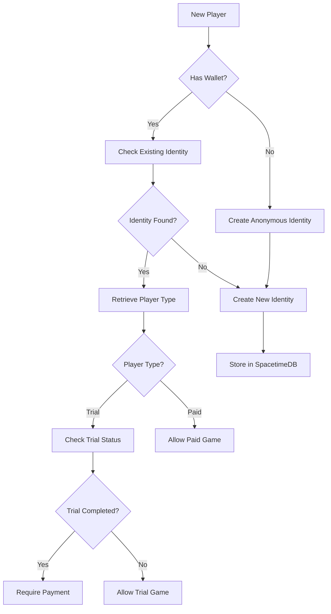

# SpacetimeDB Identity Integration Setup

## Overview

This document explains how to properly integrate SpacetimeDB's identity system with our trial/paid player management system.

## Architecture

### 1. Identity Management Flow



### 2. Database Schema

```sql
CREATE TABLE players (
    spacetime_identity TEXT PRIMARY KEY,
    player_type TEXT NOT NULL CHECK (player_type IN ('trial', 'paid')),
    wallet_address TEXT,
    session_id TEXT,
    trial_completed BOOLEAN DEFAULT FALSE,
    created_at INTEGER NOT NULL,
    updated_at INTEGER NOT NULL
);
```

### 3. JWT Integration

The JWT token now includes SpacetimeDB identity:

```typescript
{
  entryId: string;
  sessionId: string;
  identity: { walletAddress?: string; anonId?: string };
  isTrial: boolean;
  playerType: 'trial' | 'paid';
  paidTxHash?: string;
  spacetimeIdentity?: string; // NEW: SpacetimeDB identity
  exp: number;
}
```

## Implementation

### 1. Environment Variables

Add these to your `.env.local`:

```bash
# SpacetimeDB Configuration
SPACETIME_HOST=https://maincloud.spacetimedb.com
SPACETIME_DATABASE=your_database_id_here
SPACETIME_TOKEN=your_server_token_here  # Optional: Server identity token
```

### 2. API Flow

#### Game Entry Creation

1. **Create SpacetimeDB Identity**
   ```typescript
   const identityResult = await spacetimeClient.createPlayerIdentity();
   ```

2. **Store Player Mapping**
   ```typescript
   await spacetimeClient.storePlayerIdentity(
     identityResult.identity,
     isTrial ? 'trial' : 'paid',
     walletAddress
   );
   ```

3. **Include in JWT**
   ```typescript
   const token = signEntryToken({
     // ... other fields
     spacetimeIdentity: identityResult.identity,
   });
   ```

#### Trial Status Checking

1. **Check via SpacetimeDB Identity**
   ```typescript
   const playerInfo = await getPlayerIdentity(spacetimeIdentity, token);
   if (playerInfo?.trialCompleted) {
     // Trial already used
   }
   ```

2. **Check via Smart Contract** (backup)
   ```typescript
   const contractUsed = await checkTrialSessionUsed(sessionId);
   ```

### 3. Player Type Enforcement

#### Trial Players
- Can only play one game
- Cannot join prize pools
- Must use trial battle functions
- Identity marked as `trial_completed` after game

#### Paid Players  
- Unlimited games
- Can join prize pools
- Must have wallet connected
- Must pay entry fee

### 4. Migration Path

For existing systems:

1. **Anonymous Sessions** → SpacetimeDB Identity
   - Create identity on first game entry
   - Track trial usage via `trial_completed` flag

2. **Wallet Users** → Linked Identity
   - Create identity linked to wallet address
   - Automatically marked as paid players

3. **Trial → Paid Conversion**
   - Update player type to 'paid'
   - Link wallet address
   - Set `trial_completed = true`

## Testing

### Local Development

1. **Without SpacetimeDB** (Fallback Mode)
   - System uses in-memory storage
   - JWTs still work for session management
   - Smart contract checks still function

2. **With SpacetimeDB**
   - Full identity persistence
   - Cross-session trial tracking
   - Player type enforcement

### Debug Commands

```javascript
// Check SpacetimeDB connection
fetch('/api/health').then(r => r.json()).then(console.log);

// Test identity creation
fetch('/api/game-entry', {
  method: 'POST',
  headers: { 'Content-Type': 'application/json' },
  body: JSON.stringify({ 
    sessionId: 'test-session',
    isTrial: true 
  })
}).then(r => r.json()).then(console.log);

// Check trial status with identity
fetch('/api/trial-status?token=YOUR_JWT_TOKEN')
  .then(r => r.json()).then(console.log);
```

## Benefits

1. **Persistent Trial Tracking**
   - Trial usage survives browser clears
   - Works across devices with same identity

2. **Secure Player Types**
   - Enforced at database level
   - Cannot bypass via client manipulation

3. **Flexible Architecture**
   - Works with or without SpacetimeDB
   - Graceful fallback to local storage

4. **Future Expansion**
   - Ready for player profiles
   - Support for achievement tracking
   - Cross-game identity system

## Troubleshooting

### "403 Forbidden" Errors

This means authorization is failing. Check:
1. Valid JWT token in Authorization header
2. Token not expired
3. Database permissions configured

### "SpacetimeDB not available" 

System will fall back to:
1. In-memory session storage
2. Local storage for anonymous users
3. Smart contract for trial verification

### Trial Reuse Issues

If trials can be reused:
1. Check SpacetimeDB identity creation
2. Verify `trial_completed` flag is set
3. Ensure JWT includes `spacetimeIdentity`
4. Check smart contract integration
